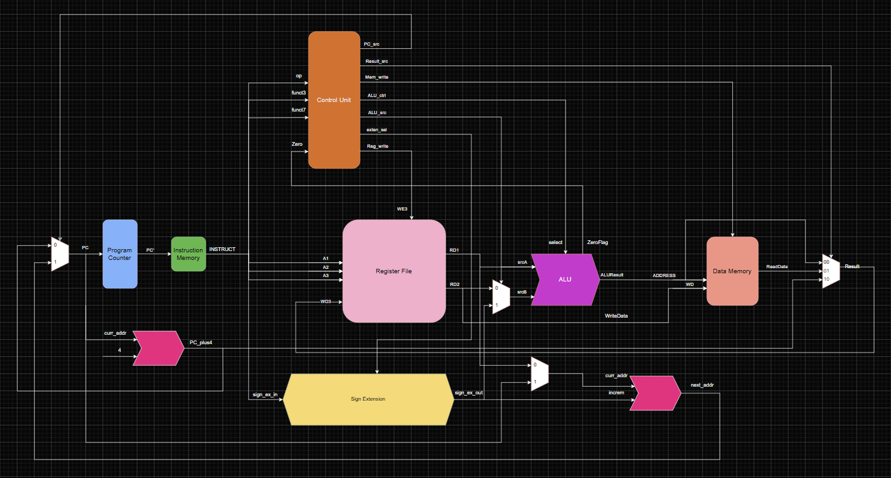
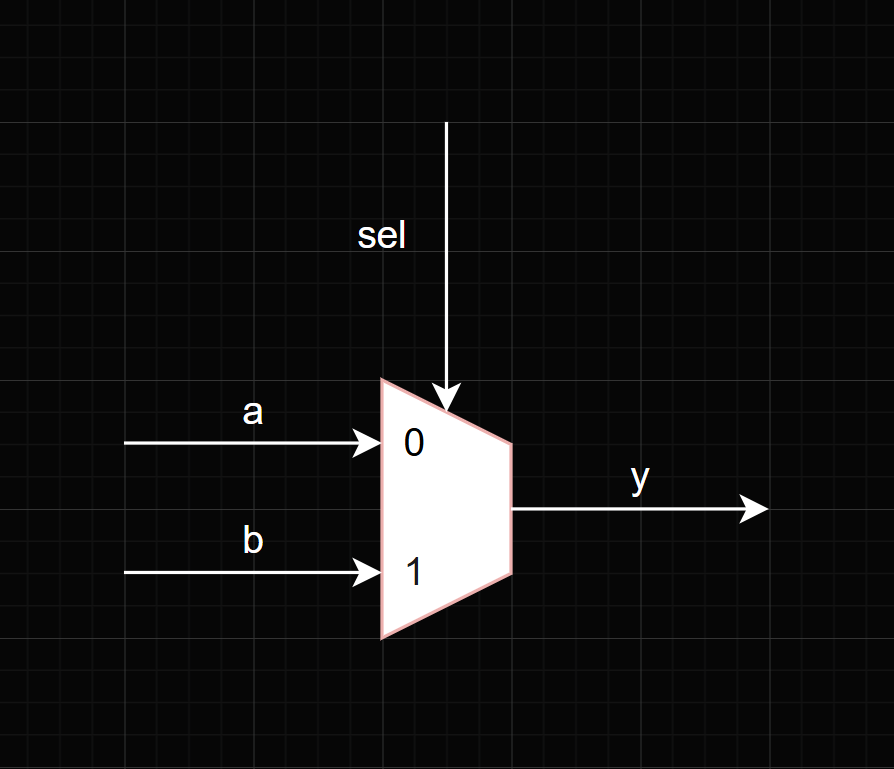
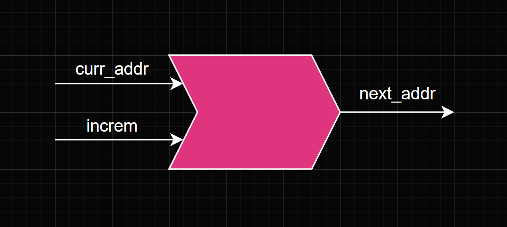

# RISC-V 32-bit Single Cycle Processor

This project implements a 32-bit single-cycle processor in SystemVerilog with Vivado based on reduced RV32I instruction subset. The CPU executes one instruction per clock cycle and supports arithmetic, logical, memory access, and branch operations. The goal of this implementation is to demonstrate a working CPU microarchitecture and validate core ISA behavior through simulation-based verification.

## Architecture Overview

## ISA

### R-Type

add, sub, and,

or, xor, sll,

srl, sra

### I-type

lw, addi, jalr

### S-type

sw

### B-type

beq

### J-type

jal

## Program Counter (PC)

### Operation

- The program counter stores the next address the CPU will go to. 

Input: clk, reset, PC

Output: PC’

### Block Diagram

### Waveform

## Instruction Memory

### Operation

- Converts byte address to word indexed via address/4 to store in memory
- Stores all instructions and outputs machine code of each instruction

Input: address

Output: instruction

### Block Diagram

### Waveform

## Register File

### Operation 

- 32 element 32-bit registers  
- A1, A2, A3 is the address of each register
- RD1 and RD2 is always combinational 
- RD1 and RD2 is the value of the respective register
- If WE is enabled then the value in register A3 will get overwritten with WD3’s data

Input: clk, reset, WE3, WD3, A1, A2, A3

Output: RD1, RD2

### Block Diagram

### Waveform

## Arithmetic Logic Unit (ALU)

### Operation

- Picks which operation is performed on a & b based on the alu_select signal

### ALU OPERATIONS

Input: a, b, alu_select

Output: ALUResult

### Block Diagram

### Waveform

## Data Memory

### Operation

- 1024 element 32-bit RAM
- Converts byte address to word indexed via ALU_Result/4 to store in memory
- Combinationally outputs value from that memory cell

Inputs: clk, WE, address, WD

Output: RD

### Block Diagram

### Waveform

## Control Unit

### Operation

- Decodes the op, funct3, funct7 fields
- Drives correct set of signals for datapath routing and ALU selection
- Implments main control logic

Inputs: op, funct3, funct7

Outputs: PCSrc, ResultSrc, MemWrite, ALUCtrl, exten_sel, RegWrite

### Block Diagram

### Waveform

// explain why 2-byte alignment for jumps and branches(sign_extn.sv)

## Multiplexer

### Operation

- Chooses which input to let through based on select signal primarily used for control logic

Inputs: a, b, sel

Outputs: y

### Block Diagram

## Adder

### Operation

- adds the two inputs one is address and other is increment

Inputs: curr_addr, increm

Outputs: next_addr

### Block Diagram

Verification strategy

Instruction 

