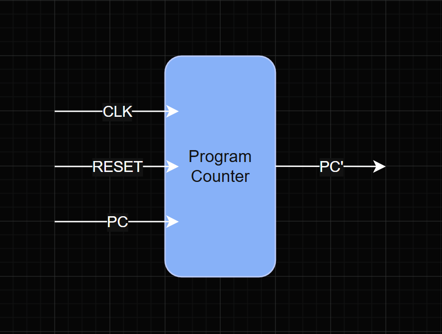
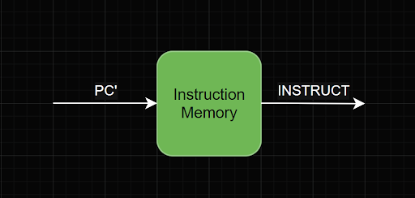
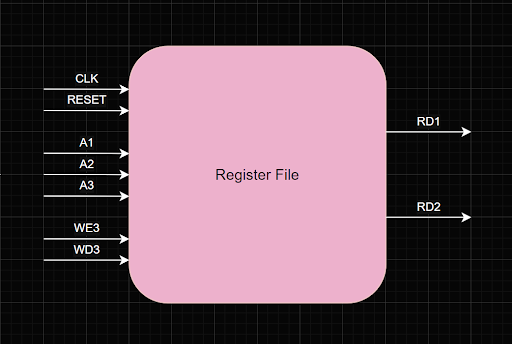
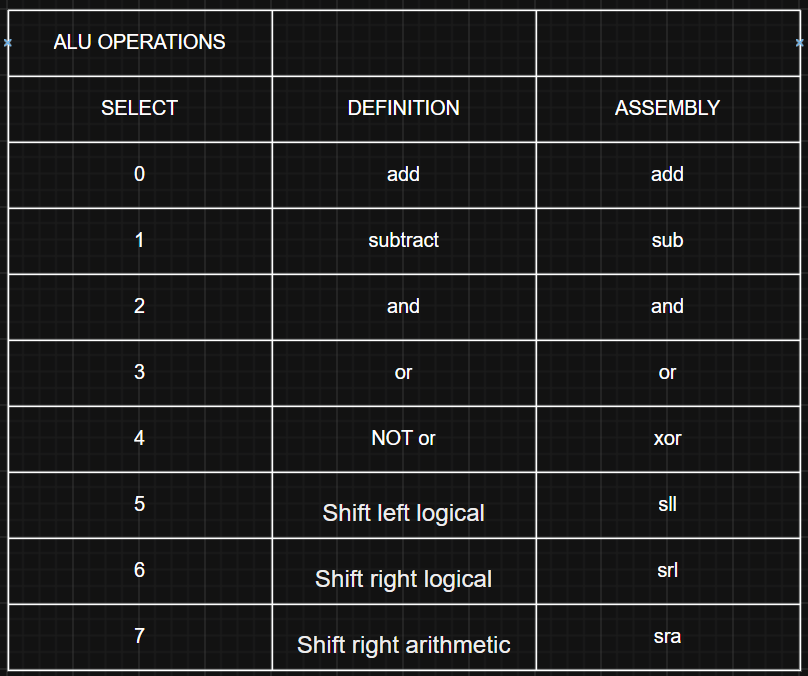
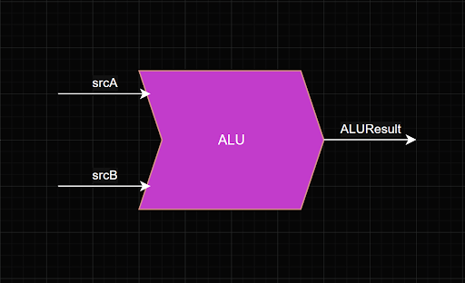
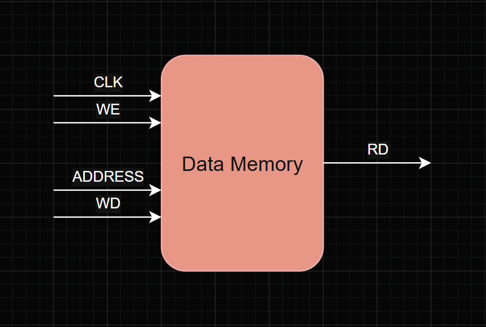
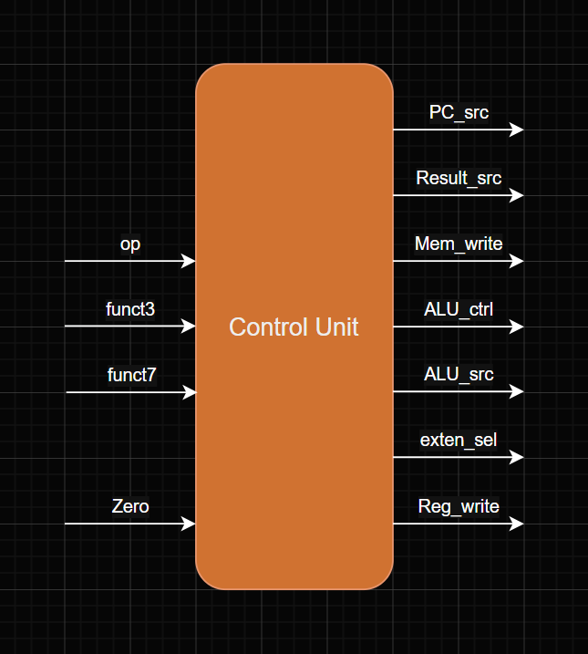

# RISC-V 32-bit Single Cycle Processor

This project implements a 32-bit single-cycle processor in SystemVerilog with Vivado based on reduced RV32I instruction subset. The CPU executes one instruction per clock cycle and supports arithmetic, logical, memory access, and branch operations. The goal of this implementation is to demonstrate a working CPU microarchitecture and validate core ISA behavior through simulation-based verification.

## ISA

### Arithmetic/Logic

add, sub, and,

or, xor, sll,

srl, sra

### Memory

lw, sw

### Control

beq, jal

## Program Counter (PC)

### Operation

The program counter stores the next address the CPU should go to. 

Input
Clk
Reset
PC
Output
PC’

### Block Diagram

### Waveform

## Instruction Memory

### Operation

Stores instructions in from assembly ROM and outputs machine code of instruction

Input
Address

Output
Instruction

### Block Diagram

### Waveform

## Register File

### Operation 

32 element 32-bit registers,  A1, A2, A3 is the address of each register, read is always  A1 = RD1 and A2 = RD2 with RD1 and RD2 being the value inside the specific register(A), if WE is enabled then the value in register A3 will get overwritten with WD3’s data

Input
Clk
Reset
WE3 
WD3 
A1
A2
A3

Output
RD1
RD2

### Block Diagram

### Waveform

## Arithmetic Logic Unit (ALU)

### Operation
Picks which operation is performed on a & b based on the alu_select signal

### ALU OPERATIONS

Input
a
b
alu_select
Output
result

### Block Diagram

### Waveform

## Data Memory

### Operation

1024 element 32-bit RAM, takes valid address converts to bye-addressable then gets the value from that address in memory and outputs it

Inputs
clk
WE
address
WD

Output
RD

### Block Diagram

### Waveform

## Control Unit

### Block Diagram

Verification strategy

Instruction 

