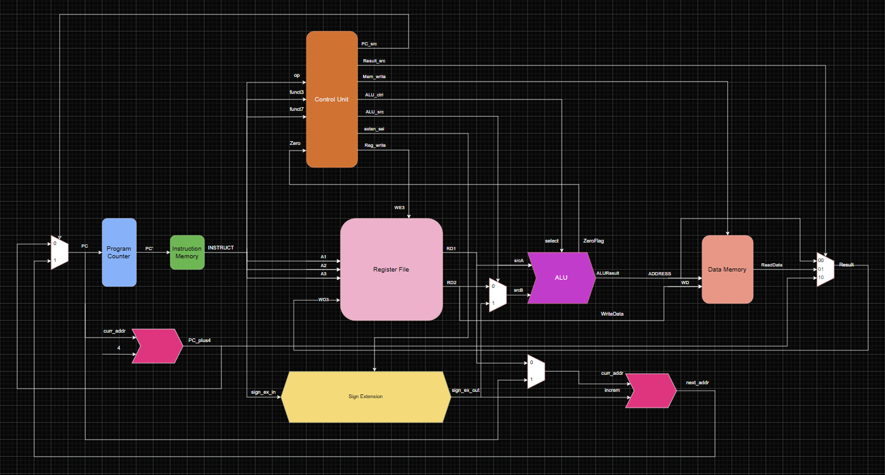
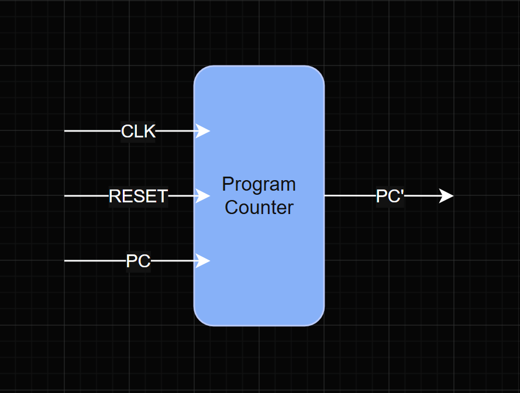
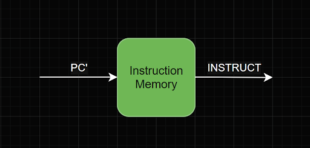
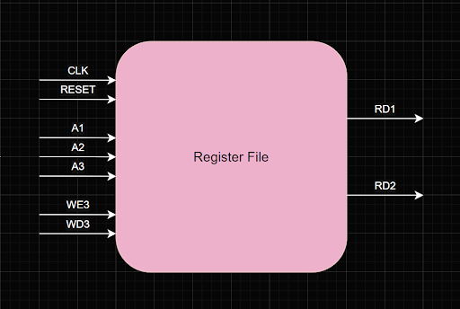
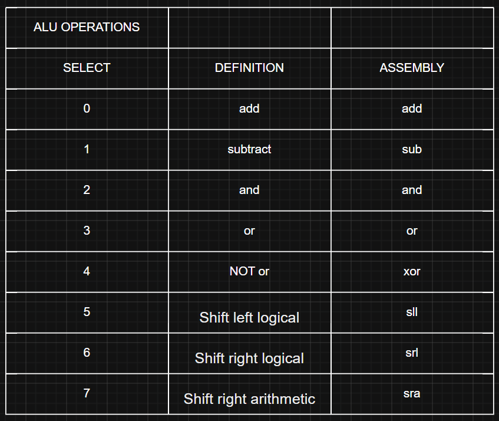
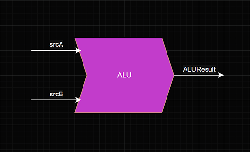
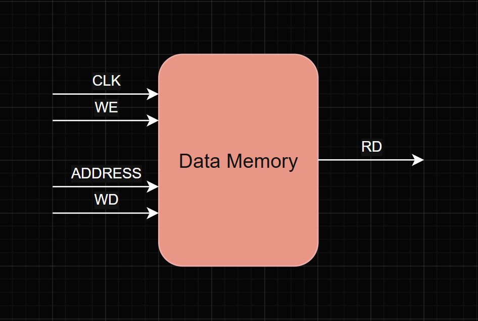
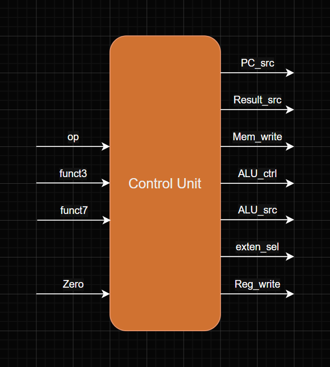
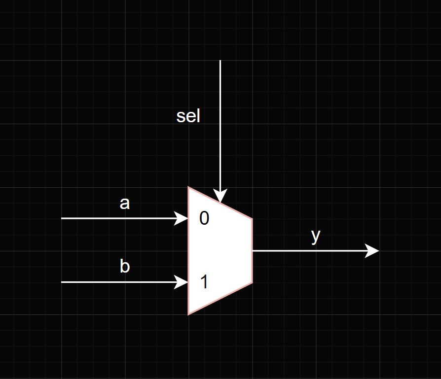
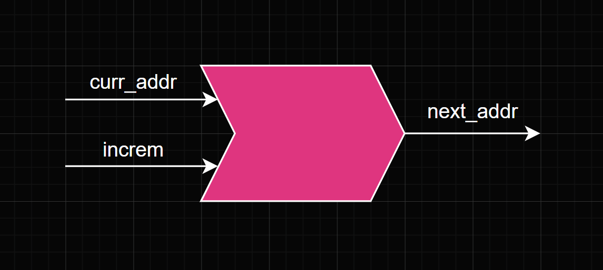

# RISC-V 32-bit Single Cycle Processor

> **Architecture Reference:** Designed following the datapath and microarchitecture specifications from *Digital Design and Computer Architecture: RISC-V Edition* (David Money Harris & Sarah L. Harris).

This project implements a 32-bit single-cycle processor in SystemVerilog paired with an automated, Python-driven verification pipeline. Based on a reduced RV32I instruction subset, the CPU executes one instruction per clock cycle across arithmetic, logical, memory access, and branch operations. Verification is fully automated by integrating the RISC-V GNU cross-compilation toolchain with Vivado CLI simulations, enabling batch execution of custom assembly test suites and cycle-accurate waveform debugging. 

## How To Run

Download

- Python 3.8+
- RISC-V GNU Toolchain (`riscv64-unknown-elf-gcc`, `riscv64-unknown-elf-objcopy`)
- AMD Xilinx Vivado (CLI binaries: `xvlog`, `xelab`, `xsim`)
- GTKWave (for `.vcd` waveform inspection)
- Git

Run

1. Clone repository.
2. Run simulate.py file in sim folder.
3. All GTKWave files can be found in build folder with that specific 
file name (ex: add.vcd) and can be opened with gtkwave build/<test_name>.vcd.

## Architecture Overview

## ISA

### R-Type

add, sub, and,

or, xor, sll,

srl, sra

### I-type

lw, addi, jalr

### S-type

sw

### B-type

beq

### J-type

jal

## Program Counter (PC)

### Operation

- The program counter stores the current address of the CPU.

Input: CLK, RESET, PC

Output: PC'

### Block Diagram

## Instruction Memory

### Operation

- Converts byte address (PC') to word indexed via address/4 to fetch instructions from memory
- Stores all instructions and outputs machine code of each instruction

Input: PC'

Output: INSTRUCT

### Block Diagram

## Register File

### Operation 

- 32 element 32-bit registers  
- A1, A2, A3 is the address of each register
- RD1 and RD2 are always combinational 
- RD1 and RD2 is the value of the respective register
- If WE is enabled then the value in register A3 will get overwritten with WD3’s data

Input: CLK, RESET, WE3, WD3, A1, A2, A3

Output: RD1, RD2

### Block Diagram

## Arithmetic Logic Unit (ALU)

### Operation

- Picks which operation is performed on a & b based on the alu_select signal

### ALU OPERATIONS

Input: srcA, srcB, alu_select

Output: ALUResult

### Block Diagram

## Data Memory

### Operation

- 1024 element 32-bit RAM
- Converts byte address to word indexed via ALU_Result/4 to store in memory
- Combinationally outputs value from that memory cell

Inputs: CLK, WE, ADDRESS, WD

Output: RD

### Block Diagram

## Control Unit

### Operation

- Decodes the op, funct3, funct7 fields
- Drives correct set of signals for datapath routing and ALU selection
- Implements main control logic
- Enforces 2-byte alignment for B-type & J-type offsets. Since target addresses are always even (ending in 0), omitting bit 0 expands the immediate range without losing precision, ensuring RVC compatibility.

Inputs: op, funct3, funct7

Outputs: PCSrc, ResultSrc, MemWrite, ALUCtrl, exten_sel, RegWrite

### Block Diagram

## Multiplexer

### Operation

- Chooses which input to let through based on select signal primarily used for control logic

Inputs: a, b, sel

Outputs: y

### Block Diagram

## Adder

### Operation

- Adds the two inputs

Inputs: curr_addr, increm

Outputs: next_addr

### Block Diagram

### Verification Strategy

The CPU is verified using an automated, self-checking simulation driven by a custom Python script. Rather than manually inspecting waveforms for every instruction, the processor executes RISC-V assembly test suites to validate architectural compliance.

The testing architecture works as follows:

1. **Cross-Compilation:** The Python script uses the RISC-V GNU Compiler toolchain (`riscv64-unknown-elf-gcc`) to compile bare-metal assembly tests into `.elf` binaries. These are then converted into 4-byte aligned Verilog hex files using `objcopy`.

2. **Automated Simulation:** Xilinx Vivado command-line tools (`xvlog`, `xelab`, `xsim`) compile the SystemVerilog datapath. The Python script loops through the test suite, dynamically injecting each `.hex` file into the CPU's Instruction Memory via `$value$plusargs`.

3. **Waveform Debugging:** The testbench automatically generates a `.vcd` for the current file. This allows for cycle-accurate debugging of datapath routing and control signals using GTKWave.

### Future Plans

To expand this project, future work includes implementing Memory-Mapped I/O (MMIO) with a UART module and transitioning the microarchitecture to a 5-stage pipeline.

